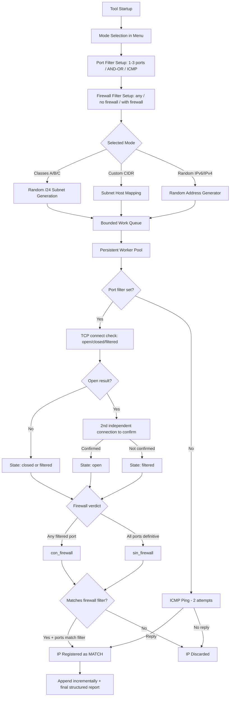

# IP Scanner Advanced

[](https://opensource.org/licenses/MIT)
[](https://www.python.org/)
[]()

A professional, fast, and concurrent Python tool for scanning, discovering, and classifying active IP addresses (IPv4 and IPv6) on local and public networks.

---

## Key Features

*   **Fast Port-Based Detection:** Filter results by **1 to 3 TCP ports of interest**. Instead of returning random alive hosts, the tool returns **only** the IPs that have the selected port(s) `OPEN`. For example, select port `22` to discover only hosts exposing SSH — regardless of version — or combine ports with `AND`/`OR` matching modes.
*   **Verified Port State + Firewall Detection (NEW):** Every port is classified into a real TCP state — `open`, `closed` (active refusal) or `filtered` (no response) — and an `open` result is confirmed with a second, independent connection before being reported, cutting down false positives against tools like Nmap (e.g. hosts/tarpits that accept a handshake once but not consistently). On top of that, you can filter by firewall presence: only hosts that respond clearly (`sin firewall`, ready for direct scanning) or only hosts where at least one probed port is silently dropped (`con firewall`).
*   **Lightweight TCP Scanning (Termux-friendly):** Port detection uses direct, non-blocking **socket connections** instead of spawning a `ping` subprocess per host. This removes the process/file-descriptor exhaustion that made the tool crash on Termux after several runs.
*   **Bounded Queue + Worker Model:** A single persistent pool of worker threads consumes IPs from a size-limited queue (backpressure). Memory stays flat and thread pools are no longer created/destroyed in tight loops, keeping long sessions stable.
*   **Improved Interface:** Colorized banner, structured menu, a common-ports reference table, and live match reporting with the open ports for each hit.
*   **Public IP Class Scanning:** Native support for random segmentation and inspection of network blocks:
    *   **Class A:** `1.0.0.0` - `126.255.255.255`
    *   **Class B:** `128.0.0.0` - `191.255.255.255`
    *   **Class C:** `192.0.0.0` - `223.255.255.255`
*   **IPv6 Support:** Scanning of custom networks and random generation of global unicast IPv6 addresses (`2000::/3`).
*   **Custom CIDR Scanning:** Allows scanning any specific subnet in CIDR format (e.g., `192.168.1.0/24` or `2001:db8::/64`).
*   **Dual-Ping Attempt:** When no port filter is set, hosts are verified via ICMP with fast retries to avoid false negatives.
*   **Incremental + Structured Persistence:** Each hit is appended to disk the moment it is found (no data loss on crash), and a final structured report is written on exit, sorted by network class and annotated with the open ports.
*   **Safe and Graceful Shutdown:** Captures `CTRL+C` to stop cleanly, drain workers, display a summary, and save results.

---

## Architecture and Operation

The scanner works by sending ICMP requests (pings) to the addresses generated or mapped in the selected subnet.



---

## Requirements and Installation

### Prerequisites
*   **Python 3.6+**
*   Administrator/root permissions (some environments require elevated privileges to send ICMP packets massively or quickly).

### Installation
Clone or download this repository directly to your machine:

```bash
git clone https://github.com/nostraxiten/IPsearcher.git
cd IPsearcher
```

The script uses libraries from the Python standard library (`socket`, `threading`, `ipaddress`, `subprocess`, etc.), so **no additional external dependencies are required**.

---

## Usage Instructions

Run the main script with the Python interpreter:

```bash
python IPSearch.py
```

### Interactive Menu Options

Upon startup, an interactive menu will be presented in the terminal with the following options:

| Option | Description |
| :---: | :--- |
| **`[1]`** | **Class A:** Generates and scans `/24` network blocks within the Class A range indefinitely. |
| **`[2]`** | **Class B:** Generates and scans `/24` network blocks within the Class B range indefinitely. |
| **`[3]`** | **Class C:** Generates and scans `/24` network blocks within the Class C range indefinitely. |
| **`[4]`** | **All Classes:** Combines and scans Class A, B, and C subnets in a balanced manner. |
| **`[5]`** | **Exit:** Safely terminates execution. |
| **`[6]`** | **Custom Network:** Requests a CIDR address (e.g., `192.168.1.0/24`) and scans it in full. |
| **`[7]`** | **Random IPv6:** Performs a massive scan of randomly generated global IPv6 addresses. |
| **`[8]`** | **Random IPv4:** Scans individual random IPv4 addresses sampled across classes A/B/C. |

### Port Filter (Fast Detection)

After picking a mode, the tool asks for the ports you care about. This step applies to **every** mode:

*   Leave it empty to keep the classic **ICMP ping** detection.
*   Enter **1 to 3 ports**, comma-separated (e.g. `22` for SSH only, or `80,443` for web hosts).
*   With more than one port you choose the matching mode:
    *   **`[1] ALL` (AND):** the IP is reported only if **every** selected port is open (stricter).
    *   **`[2] ANY` (OR):** the IP is reported if **at least one** selected port is open.

Only IPs that satisfy the filter are shown and saved — no random results. Detection is fast because a port that doesn't confirm as open in `ALL` mode discards the host immediately.

Each probed port is classified as `open`, `closed` (active refusal, e.g. RST) or `filtered` (no response at all). A port only counts as `open` after a **second, independent connection confirms it** — this is what keeps results consistent with Nmap: a single successful `connect()` isn't proof of a real service, since some firewalls/tarpits complete a handshake once (or intermittently) without there being anything actually listening behind it.

### Firewall Filter (NEW)

Right after the port filter (only when at least one port is set), the tool asks:

*   **`[1]` Any** *(default)*: no firewall-based filtering.
*   **`[2]` IPs WITHOUT firewall:** only shows hosts where every probed port gave a definitive answer (`open` or `closed`) — i.e. nothing is silently dropping packets, so the host is a good candidate for direct/deeper scanning.
*   **`[3]` IPs WITH firewall:** only shows hosts where at least one probed port was `filtered` (no response), which typically indicates a firewall/IDS dropping the packet.

This lets you target exactly what you're looking for: hosts that will let you scan them further, or hosts that are actively filtering traffic.

You can also lower the thread count and connection timeout when prompted — useful on constrained devices (Termux / mobile).

---

## Storage Structure

Results are automatically saved in a dedicated directory to avoid overwriting previous runs:

*   **Output folder:** `/IPs` (automatically created in the script's directory).
*   **File format:** `ips_vivas_{counter}.txt`.
*   **Report content:**
    ```text
    # IPs FOUND ALIVE
    # File: 1
    # Total: 3
    # Date: 2026-07-16 21:25:00
    # ==================================================

    # CLASS C (192.0.0.0 - 223.255.255.255)
    192.168.1.1
    192.168.1.50
    192.168.1.100
    ```

---

## Internal Configuration Parameters

You can adjust the scanner's behavior by modifying the attributes in the initialization of the `IPScannerAdvanced` class in the `IPSearch.py` file:

*   `self.threads = 100`: Number of concurrent worker threads.
*   `self.timeout = 1`: Timeout in seconds for the ICMP ping response.
*   `self.port_timeout = 1.2`: Timeout in seconds for each TCP port connection.
*   `self.pings_per_ip = 2`: Number of ping attempts per IP address (ICMP mode only).
*   `self.max_hosts_scan_ipv4 = 1000`: Limit of hosts sampled per large IPv4 network segment.
*   `self.work_queue = queue.Queue(maxsize=3000)`: Bounded work queue that caps memory usage and provides backpressure to the producers.
*   `self.verify_delay = 0.15`: Delay in seconds between the first and second connection attempt when confirming a port as `open`.

Ports and matching mode (`self.ports_filter`, `self.match_mode`), as well as the firewall filter (`self.firewall_mode`), are configured interactively at runtime.

---

> [!WARNING]
> **Usage and Responsibility Notice:**
> This tool is designed for educational purposes, network diagnostics, and authorized auditing. Unauthorized scanning of networks you do not own may violate service policies or local cybersecurity laws. Use responsibly.
