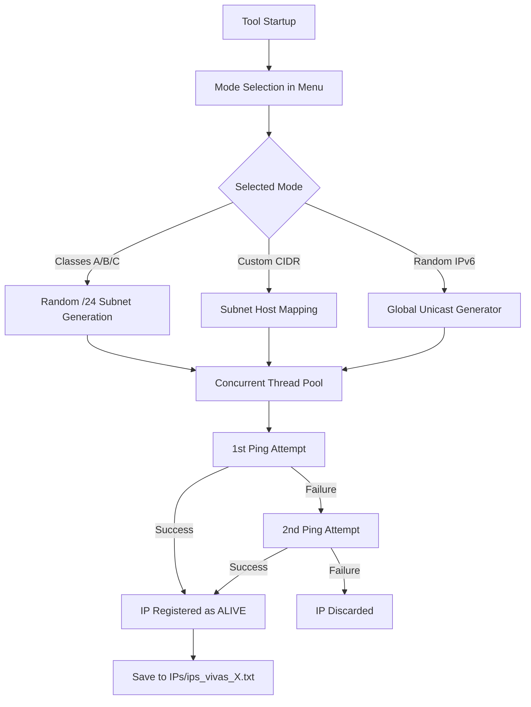

# IP Scanner Advanced

[](https://opensource.org/licenses/MIT)
[](https://www.python.org/)
[]()

A professional, fast, and concurrent Python tool for scanning, discovering, and classifying active IP addresses (IPv4 and IPv6) on local and public networks.

---

## Key Features

*   **Advanced Multithreaded Scanning:** Implemented with `ThreadPoolExecutor` to maximize speed and bandwidth usage efficiency.
*   **Public IP Class Scanning:** Native support for random or sequential segmentation and inspection of network blocks:
    *   **Class A:** `1.0.0.0` - `126.255.255.255`
    *   **Class B:** `128.0.0.0` - `191.255.255.255`
    *   **Class C:** `192.0.0.0` - `223.255.255.255`
*   **IPv6 Support:** Scanning of custom networks and random generation of global unicast IPv6 addresses (`2000::/3`).
*   **Custom CIDR Scanning:** Allows scanning any specific subnet in CIDR format (e.g., `192.168.1.0/24` or `2001:db8::/64`).
*   **Dual-Ping Attempt:** Intelligent verification system with fast retries to avoid false negatives due to latency or network congestion.
*   **Automatic Result Persistence:** Automatically saves the IPs found in structured files, sorted by their respective network class.
*   **Safe and Graceful Shutdown:** Captures system signals (`CTRL+C`) to stop the scan at any time, displaying an immediate summary and saving the results obtained so far without any data loss.

---

## Architecture and Operation

The scanner works by sending ICMP requests (pings) to the addresses generated or mapped in the selected subnet.



---

## Requirements and Installation

### Prerequisites
*   **Python 3.6+**
*   Administrator/root permissions (some environments require elevated privileges to send ICMP packets massively or quickly).

### Installation
Clone or download this repository directly to your machine:

```bash
git clone https://github.com/nostraxiten/IPsearcher.git
cd IPsearcher
```

The script uses libraries from the Python standard library (`socket`, `threading`, `ipaddress`, `subprocess`, etc.), so **no additional external dependencies are required**.

---

## Usage Instructions

Run the main script with the Python interpreter:

```bash
python IPSearch.py
```

### Interactive Menu Options

Upon startup, an interactive menu will be presented in the terminal with the following options:

| Option | Description |
| :---: | :--- |
| **`[1]`** | **Class A:** Generates and scans `/24` network blocks within the Class A range indefinitely. |
| **`[2]`** | **Class B:** Generates and scans `/24` network blocks within the Class B range indefinitely. |
| **`[3]`** | **Class C:** Generates and scans `/24` network blocks within the Class C range indefinitely. |
| **`[4]`** | **All Classes:** Combines and scans Class A, B, and C subnets in a balanced manner. |
| **`[5]`** | **Exit:** Safely terminates execution. |
| **`[6]`** | **Custom Network:** Requests a CIDR address (e.g., `192.168.1.0/24`) and scans it in full. |
| **`[7]`** | **Random IPv6:** Performs a massive scan of randomly generated global IPv6 addresses. |

---

## Storage Structure

Results are automatically saved in a dedicated directory to avoid overwriting previous runs:

*   **Output folder:** `/IPs` (automatically created in the script's directory).
*   **File format:** `ips_vivas_{counter}.txt`.
*   **Report content:**
    ```text
    # IPs FOUND ALIVE
    # File: 1
    # Total: 3
    # Date: 2026-07-16 21:25:00
    # ==================================================

    # CLASS C (192.0.0.0 - 223.255.255.255)
    192.168.1.1
    192.168.1.50
    192.168.1.100
    ```

---

## Internal Configuration Parameters

You can adjust the scanner's behavior by modifying the attributes in the initialization of the `IPScannerAdvanced` class in the `IPSearch.py` file:

*   `self.threads = 80`: Number of concurrent threads for scanning.
*   `self.timeout = 1`: Timeout in seconds for the ping response.
*   `self.pings_per_ip = 2`: Number of ping attempts per IP address.
*   `self.max_hosts_scan_ipv4 = 1000`: Limit of hosts to scan per large IPv4 network segment to avoid memory saturation.

---

> [!WARNING]
> **Usage and Responsibility Notice:**
> This tool is designed for educational purposes, network diagnostics, and authorized auditing. Unauthorized scanning of networks you do not own may violate service policies or local cybersecurity laws. Use responsibly.
