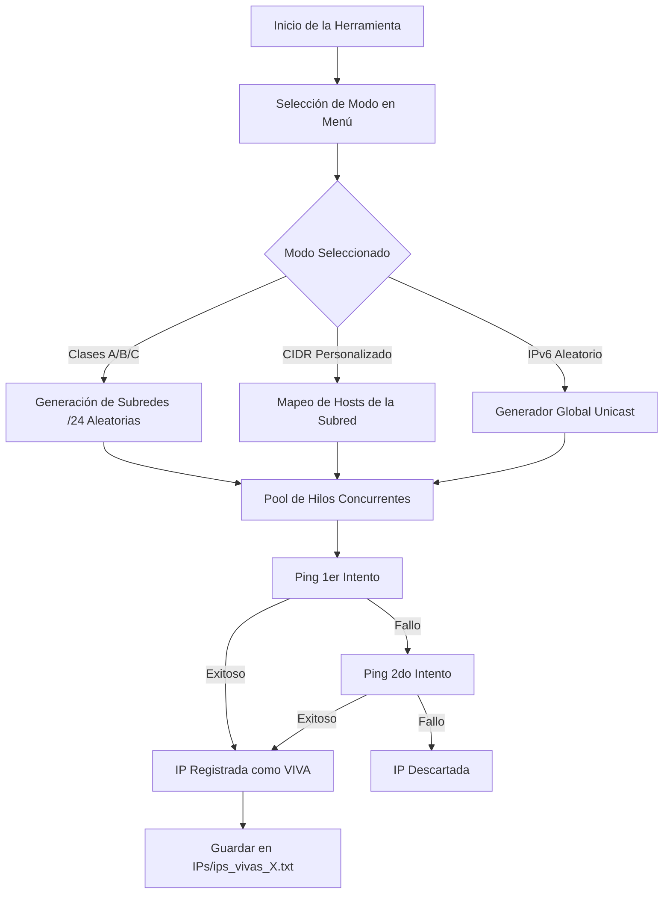

# IP Scanner Advanced

[](https://opensource.org/licenses/MIT)
[](https://www.python.org/)
[]()

Una herramienta profesional, rápida y concurrente escrita en Python para el escaneo, descubrimiento y clasificación de direcciones IP activas (IPv4 e IPv6) en redes locales y públicas.

---

## Características Principales

*   **Escaneo Multihilo Avanzado:** Implementado con `ThreadPoolExecutor` para maximizar la velocidad y la eficiencia en el uso de ancho de banda.
*   **Escaneo de Clases Públicas de IP:** Soporte nativo para segmentación e inspección aleatoria o secuencial de bloques de red:
    *   **Clase A:** `1.0.0.0` - `126.255.255.255`
    *   **Clase B:** `128.0.0.0` - `191.255.255.255`
    *   **Clase C:** `192.0.0.0` - `223.255.255.255`
*   **Soporte de IPv6:** Escaneo de redes personalizadas y generación aleatoria de direcciones IPv6 globales unicast (`2000::/3`).
*   **Escaneo CIDR Personalizado:** Permite escanear cualquier subred específica en formato CIDR (ej: `192.168.1.0/24` o `2001:db8::/64`).
*   **Ping de Doble Intento (Dual-Ping):** Sistema de verificación inteligente con reintentos rápidos para evitar falsos negativos debido a latencia o congestión de la red.
*   **Persistencia Automática de Resultados:** Guarda automáticamente las IPs encontradas en archivos estructurados y ordenados por su respectiva clase de red.
*   **Apagado Seguro y Grácil:** Captura de señales del sistema (`CTRL+C`) para detener el escaneo en cualquier momento, mostrando un resumen inmediato y guardando los resultados obtenidos hasta el momento sin pérdida de información.

---

## Arquitectura y Funcionamiento

El escáner funciona mediante el envío de solicitudes ICMP (pings) a las direcciones generadas o mapeadas en la subred seleccionada.



---

## Requisitos e Instalación

### Requisitos Previos
*   **Python 3.6+**
*   Permisos de administrador/root (algunos entornos requieren privilegios elevados para enviar paquetes ICMP de forma masiva o rápida).

### Instalación
Clona o descarga este repositorio directamente en tu máquina:

```bash
git clone https://github.com/tu-usuario/IPsearcher.git
cd IPsearcher
```

El script utiliza librerías de la biblioteca estándar de Python (`socket`, `threading`, `ipaddress`, `subprocess`, etc.), por lo que **no requiere dependencias externas adicionales**.

---

## Instrucciones de Uso

Ejecuta el script principal con intérprete de Python:

```bash
python IPSearch.py
```

### Opciones del Menú Interactívo

Al iniciar, se presentará un menú interactivo en la terminal con las siguientes opciones:

| Opción | Descripción |
| :---: | :--- |
| **`[1]`** | **Clase A:** Genera y escanea bloques de red `/24` dentro del rango Clase A de manera indefinida. |
| **`[2]`** | **Clase B:** Genera y escanea bloques de red `/24` dentro del rango Clase B de manera indefinida. |
| **`[3]`** | **Clase C:** Genera y escanea bloques de red `/24` dentro del rango Clase C de manera indefinida. |
| **`[4]`** | **Todas las Clases:** Combina y escanea de manera balanceada subredes de Clase A, B y C. |
| **`[5]`** | **Salir:** Termina la ejecución de forma segura. |
| **`[6]`** | **Red Personalizada:** Solicita una dirección CIDR (ej. `192.168.1.0/24`) y escanea su totalidad. |
| **`[7]`** | **IPv6 Aleatorio:** Escanea de forma masiva direcciones IPv6 globales generadas aleatoriamente. |

---

## Estructura del Almacenamiento

Los resultados se guardan automáticamente en un directorio dedicado para evitar sobreescribir ejecuciones anteriores:

*   **Carpeta de salida:** `/IPs` (creada automáticamente en el directorio del script).
*   **Formato del archivo:** `ips_vivas_{contador}.txt`.
*   **Contenido del reporte:**
    ```text
    # IPs VIVAS ENCONTRADAS
    # Archivo: 1
    # Total: 3
    # Fecha: 2026-07-16 21:25:00
    # ==================================================

    # CLASE C (192.0.0.0 - 223.255.255.255)
    192.168.1.1
    192.168.1.50
    192.168.1.100
    ```

---

## Parámetros de Configuración Interna

Puedes ajustar el comportamiento del escáner modificando los atributos en la inicialización de la clase `IPScannerAdvanced` en el archivo `IPSearch.py`:

*   `self.threads = 80`: Cantidad de hilos concurrentes para el escaneo.
*   `self.timeout = 1`: Tiempo de espera en segundos para la respuesta de ping.
*   `self.pings_per_ip = 2`: Número de intentos de ping por dirección IP.
*   `self.max_hosts_scan_ipv4 = 1000`: Límite de hosts a escanear por segmento de red IPv4 grande para evitar saturación de memoria.

---

> [!WARNING]
> **Aviso de Uso y Responsabilidad:**
> Esta herramienta está diseñada con fines educativos, de diagnóstico de red y auditoría autorizada. El escaneo no autorizado de redes ajenas puede infringir políticas de servicio o leyes locales de ciberseguridad. Úsese con responsabilidad.
